# Repositório de Códigos de Aulas Gostack 11

## Desafios individuais

#### GoFinances - Desafio Upload de CSV (desafios/primeiro-projeto-react)

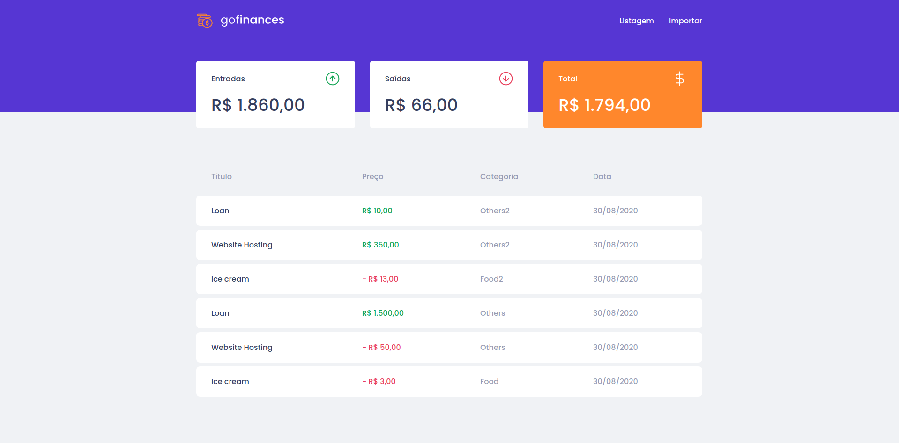

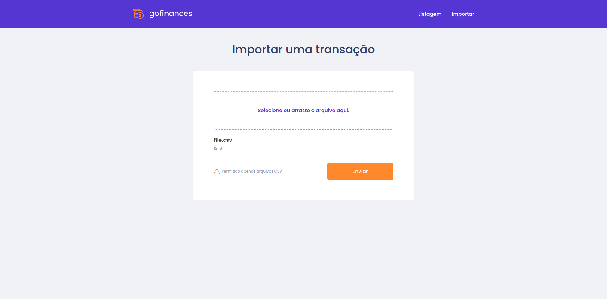

#### GoMarketplace - Desafio mobile context API  ( desafios/desafio-fundamentos-react-native/)

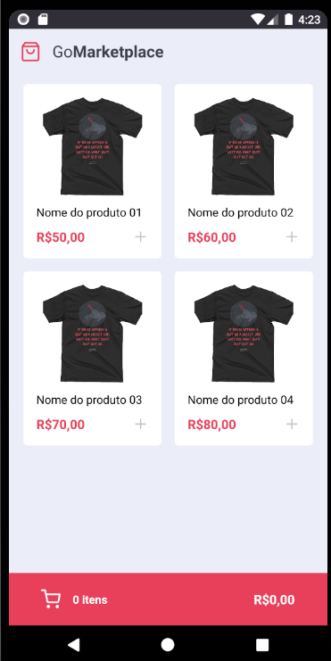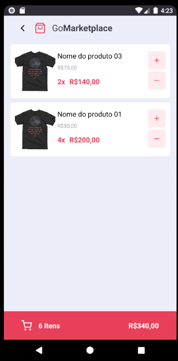

## Aulas

#### Primeiro projeto React - Github Explorer (aulas/primeiro-projeto-react)

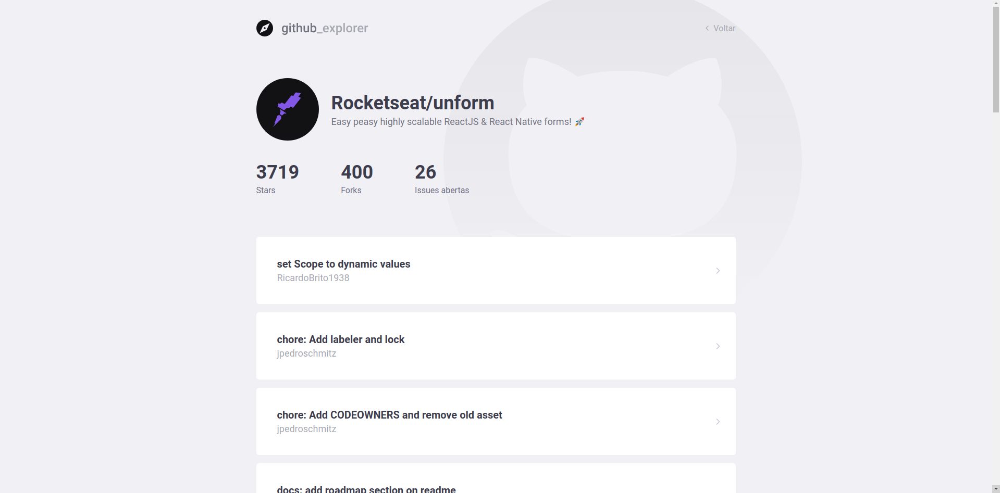
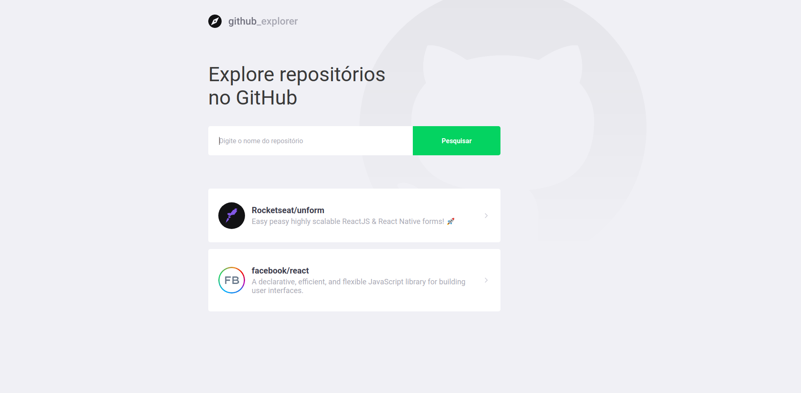

#### GoBarber Web (aulas/gobarber-web)

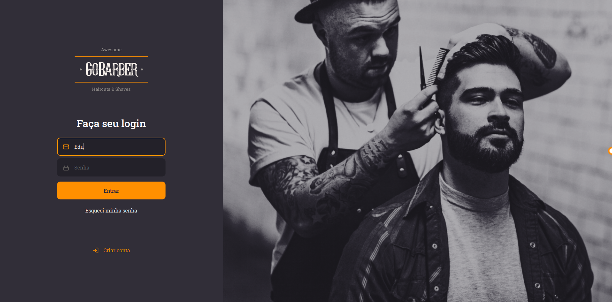

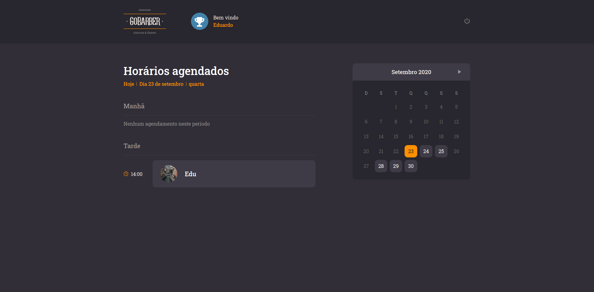
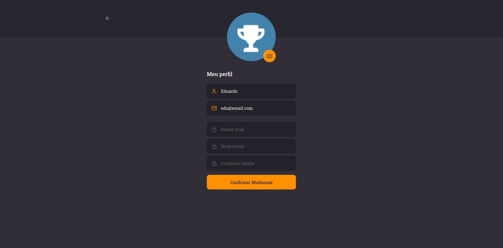
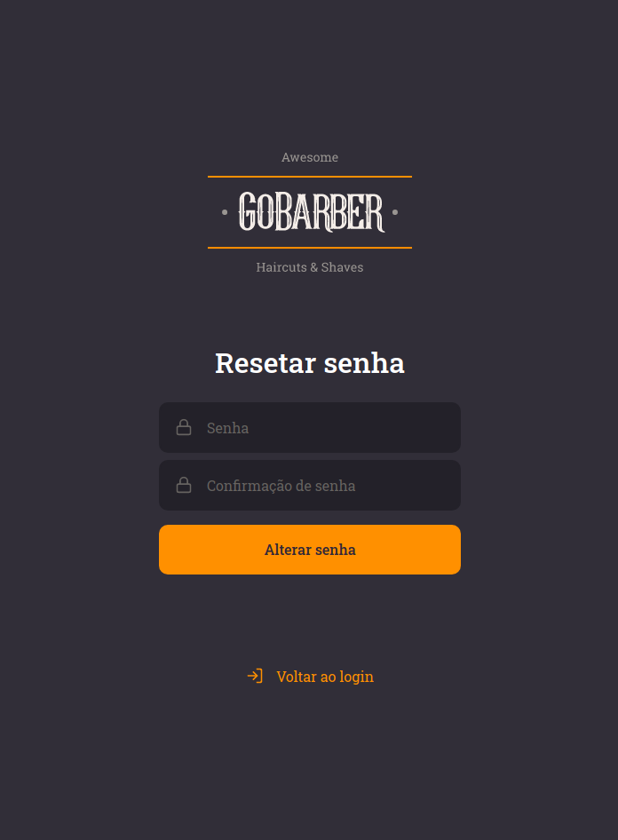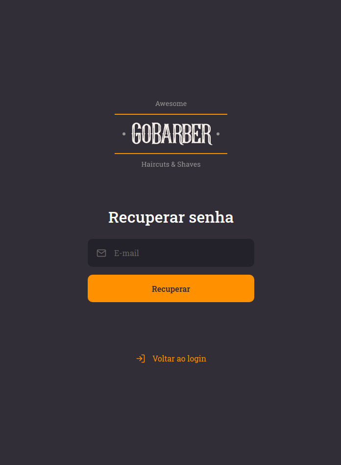